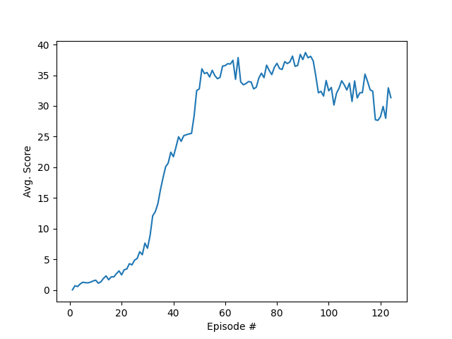

# Learning algorithm 

The task of learning a policy within the Unity ML-Agents Reacher Environment was solved by means of [deep deterministic policy gradient (DDPG)](https://arxiv.org/abs/1509.02971) for agent training.

Here, "version 2" with 20 agents acting in parallel on the environment was solved.
The parallelism was exploited by collecting experiences of the 20 agents, storing them in a unified experience replay buffer, and training a single actor and critic network. 
To smoothen the learning process, learning was carried out after every 20th time step for 10 times, by randomly choosing 128 samples from a $10^5$ sized buffer (without prioritization). 
An Ornstein-Uhlenbeck process noise was added to the learning to avoid getting stuck in local minima early.

A squared error loss function was chosen and the gradients obtained during backpropagation were clamped to a range of $[-1,1]$, both for actor and critic. 
The learning rate was set to $\alpha = 10^{-4}$, also both for actor and critic.
Soft updates from local to target networks were carried out with $\tau = 10^{-3}$.

Actor and critic were both deep nets with 33 inputs, two fully connected hidden layers with Relu activation, and an output layer with tanh activation function.

# Results

As can be seen from the plot, the the agent is able to receive an average reward over 30, whereas the average was carried out over all 20 agents and over a time window of 100 episodes. The target was reached after 124 epsiodes.

The reward plot shows in particular a quite smooth evolution of the scores, or in other words a stable learning of the agent. This is probably due to 
+ the smoothing effects of agents exploring 
+ the environment simultaneously, utilizing only weak process noise, 
+ and choosing only small step lengths.

In contrast, the tuning parameters found to be most sensitive were the variance of the Ornstein-Uhlenbeck noise and the step length during stoachstic gradient descend.

# Outlook

Possible future work could compare the performance of DDPG with other distributed learning approaches. 
In addition, it somewhow remains and open question, whether the proposed strategy of learning n times every m-th time step is actually equivalent to adapting the number of drawn samples from the replay buffer and its size.

Another improvement could be by adding prioritization to the replay buffer.